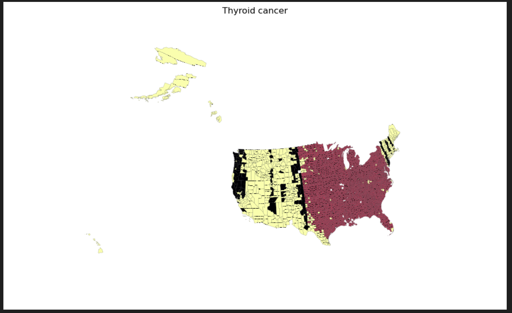
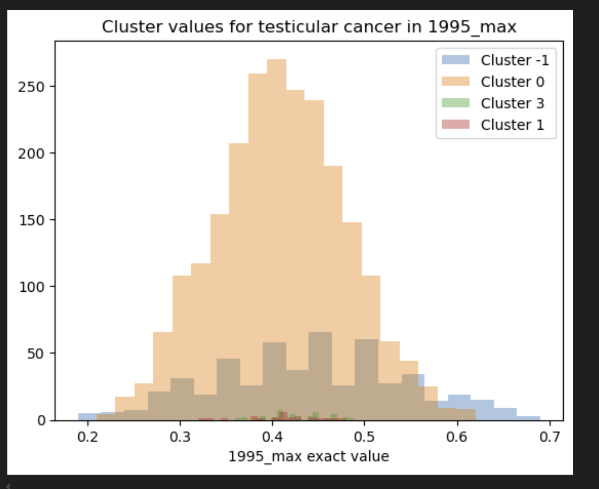

# Cancer Analysis Project

By Ishan Sharma

### My goal

In this project, I seek to analyze cancer data across the United States and compare them against various indices that could plausibly be causing higher rates. Through, this, I wish to be able to construct a model which can predict cancer based on such indices.

The impact of such a solution would be a list of potential causes of cancer which could be further analyzed, and if indeed proven they could be dealt with. This would improve the health of the United States

### My data

My data consists of a very granular analysis of cancer data by county, over several years. Being too dense to attach to a github repo, I shall instead link to the dataset [here](https://1drv.ms/f/s!AneQxAmQInlBks8f2UygKzbvNH3F6w?e=Leb351), downloaded [here](https://ghdx.healthdata.org/record/ihme-data/united-states-cancer-mortality-rates-county-1980-2014). 

The first, and perhaps simplest, part of the dataset, is under "Annual". This is data of cases the US and various states by year. It is raw data, where there are columns for location, cause, sex, and bounds, and this data is collated under several states. 

The second part of the dataset is under "linking_ids". This is less data and more of an index to keep all of the IDs straight. 

The third part of this dataset is under "national". This consists of multiple sheets, all of differing rates of cancer by county over the years from 1980 to 2014. 

The fourth part of this dataset, "percent_difference", consists of an index of IDs, as well as a list of percent changes in cases over time, in common with "Annual". 

The fifth part of this dataset, "state_by_state" consists of excel spreadsheets, each of showing several states broken down by county. In separate sheets are data for various types of cancer by time interval, and together all these spreadsheets contain data for cancer broken down in each county of the United States by time interval. 

The sixth part of this dataset, "top_and_bottom", contains cancers and their mortality rates by US county, with top and bottom 10 ranked causes. This is data that may be unnecessary, as I can process this (and more than just top and bottom) myself. This contains columns for processing standard, county, ranking of cause, the cause itself, and mortality rates.

### Project Organization

In my first notebook, `notebooks\first_pass.ipynb`, I have sifted through my data in an effort to clean it for the first time. 

In my second notebook, `notebooks\eda_and_basic_modelling.ipynb`, I have engaged in what the title states, EDA and basic modelling. The bulk of my EDA is focused on `data\national`, which contains the most comprehensive amount of data, cancer mortality rates divided by county and divided by 37 different types of cancer. To prevent myself from being overloaded, I have decided to investigate general US mortality rates, and mortality rates in the minimum and maximum counties and states. Some notable findings I have uncovered includes that:
* Summit County, Colorado consistently appears as a county with the lowest mortality rate
* Oglala Lakota County, South Dakota consistently appears as a county with the highest mortality rate
* Utah consistently appears as a state with the lowest mortality rate
* The District of Columbia consistently appears as a state with the highest mortality rate, some improvement in more recent years notwithstanding

Additionally, I have engaged in very basic modelling, linear regression on all 37 of the data sheets in `data\national` to predict former dates with latter dates. Through this, I have been able to make 37 models varying from 87% to 98% in terms of accuracy - which is quite excellent - and I could theoretically stitch together these models to create one big one with identical accuracy levels, by turning sheet names into indicator variables. This provides a good jumping off point for investigating further patterns with the data and building models taking them into account. 

In my third notebook `notebooks\deep_dive.ipynb`, I have engaged in more comprehensive modelling. After a great deal of wrangling, I have used a map of US counties from [here](https://github.com/holtzy/The-Python-Graph-Gallery) to engage in geographic clustering of my data. Through my clustering, I successfully found a division of the United States into two - the east and west, with the northeast being more similar to the west - with lower cancer mortality rates in the west than the east. The reason for this is out of bounds for my project. 

### Findings

I have found, through my clustering, that the US can be divided into two, east and west, although the northeast can be included within the west. 

Cancer mortality rates are less extreme over the years in the west, and this can be shown below:

Cluster 0 represents the west, and Cluster -1 represents the east. 

### Conclusion

In conclusion, there is a difference in cancer rates between east and west. The reason for this difference is something which lies outside of the scope of this project. 
